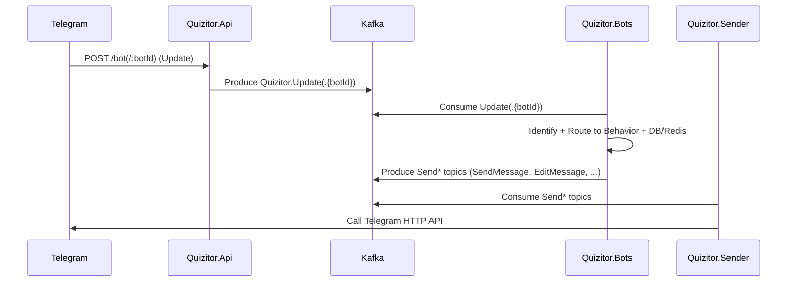
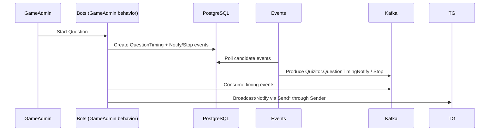

## Quizitor

Telegram-first quiz/game orchestration platform. Quizitor ingests Telegram updates via webhooks, processes them through a behavior engine, persists state in PostgreSQL, schedules quiz events, and delivers outbound Telegram actions asynchronously.

### Key features
- BackOffice bot to manage games, rounds, questions, sessions, users, roles, and mailings
- GameAdmin bot to conduct sessions: start/stop/time questions, notify participants, review submissions
- GameServer bot to interact with participants, collect answers, apply rules, and score
- Pluggable behavior engine with permissions and localization
- Reliable async I/O via Kafka for all inbound updates and outbound Telegram API calls
- Timed events (notify/auto-stop) and rating calculations
- Observability: Prometheus metrics (/metrics) and Sentry error reporting

## Architecture overview

Updates and actions are decoupled with Kafka to isolate Telegram API latency and improve reliability.



Question timing flow (notify/auto-stop):



## Solution layout
- `src/Quizitor.Api`: Ingress API for Telegram webhooks and lightweight operations
- `src/Quizitor.Bots`: Behavior engine and business logic (BackOffice, GameAdmin, GameServer, LoadBalancer)
- `src/Quizitor.Sender`: Outbound Telegram HTTP sender (consumes Send* topics)
- `src/Quizitor.Events`: Timed event processors and rating jobs
- `src/Quizitor.Migrator`: EF Core migrations/seeds executor
- `lib/Quizitor.*`: Shared libraries (Common, Data, Kafka, Redis, Logging, Localization)
- `tests/*`: Unit/integration tests

## Components and responsibilities

### Quizitor.Api (webhook ingress)
- Endpoints
  - `POST /bot`: backoffice/default bot webhook
  - `POST /bot/{botId:int}`: per-bot webhook
  - `GET /metrics`: Prometheus
  - `GET /health`: health probe
- Security
  - Validates `X-Telegram-Bot-Api-Secret-Token` for `/bot*` paths
- Processing
  - Emits `Quizitor.Update` or `Quizitor.Update.{botId}` with `UpdateContext` (includes optional `InitiatedAt`, `IsTest`)
  - Configures webhooks for all active bots on startup/shutdown (sets bot commands, updates usernames)
- Sends-only operations
  - Provides a minimal `TelegramBotClientWrapper` that publishes `SendChatAction` to Kafka (other send operations are handled by Bots/Sender)

### Quizitor.Bots (behavior engine)
- Consumes `Quizitor.Update(.{botId})` and timing topics
- Identifies users, decrypts QR if present, builds `IBehaviorContext`
- Routes to behaviors using traits:
  - Message text, bot commands, callback-query data (equals/prefix), QR data prefix
- Enforces permissions; sends localized unauthorized responses when needed
- Major behavior groups
  - BackOffice: manage bots, users/roles, games, rounds/questions (options, rules), sessions, mailings
  - GameAdmin: start/stop/time questions, team/session ops, rating views
  - GameServer: participant interactions and submissions pipeline
  - LoadBalancer: auxiliary routing (if configured)
- Outbound I/O
  - Publishes Send* requests (SendMessage, EditMessage, DeleteMessage, AnswerCallbackQuery, SendPhoto, SendChatAction) to Kafka

### Quizitor.Sender (Telegram API calls)
- Consumes Send* topics
- Executes Telegram HTTP requests with per-bot named `HttpClient`
- Records method-level histograms and E2E timing from `UpdateContext.InitiatedAt`

### Quizitor.Events (timed jobs)
- Background loops poll DB for candidate items
- Produces `Quizitor.QuestionTimingNotify` and `Quizitor.QuestionTimingStop` events
- Redis integration for rating caches (short/full, stage/final)

### Quizitor.Migrator (database migrations)
- Runs EF Core migrations and applies seeds (roles, bot commands, test data)

## Domain model (essentials)
- `Game` → `Round` → `Question`
  - `Question`
    - `Options`: available choices with `Cost`
    - `Rules`: scoring modifiers, e.g. AnyAnswer, FirstAcceptedAnswer
    - `Time`, optional `NotificationTime`, `Attempts`, `SubmissionNotificationType`
    - `Timings`: `QuestionTiming` with generated notify/stop events
- `Session`: concrete instance of a game run
- `Submission`: participant answer with computed `Score` and `Time`
- `Team`, `TeamMember`, `TeamLeader`
- `User`, `Role`, `RolePermission`, `UserPermission`, `UserRole`, `UserPrompt`
- `Bot` (type: BackOffice/GameAdmin/GameServer/LoadBalancer/Universal)
- `Mailing`, `MailingProfile`, and Filters (by Bot/BotType/Game/Session/Team/User)

## Messaging (Kafka)
Topic naming uses `Quizitor.` prefix (see `lib/Quizitor.Kafka/KafkaTopics.cs`).

- Updates
  - `Quizitor.Update`
  - `Quizitor.Update.{botId}`
- Sender (outbound Telegram)
  - `Quizitor.SendChatAction(.{botId})`
  - `Quizitor.SendMessage(.{botId})`
  - `Quizitor.SendPhoto(.{botId})`
  - `Quizitor.EditMessage(.{botId})`
  - `Quizitor.AnswerCallbackQuery(.{botId})`
  - `Quizitor.DeleteMessage(.{botId})`
- Timings
  - `Quizitor.QuestionTimingNotify`
  - `Quizitor.QuestionTimingStop`

Consumers ensure topics exist at startup and isolate per-bot streams with dedicated consumer groups.

## Storage
- PostgreSQL via EF Core (Npgsql)
  - Migrations are in `src/Quizitor.Migrator/Migrations` and are applied by `Quizitor.Migrator`
  - `ApplicationDbContext` registers repositories under `lib/Quizitor.Data`
- Redis (StackExchange.Redis)
  - Rating caches with serializers and typed storages under `lib/Quizitor.Redis`

## Observability
- Prometheus: `/metrics` in each service (histograms for webhooks handling, update processing, sender methods, overall E2E)
- Health probes: `/health`
- Sentry: enabled when `SENTRY_DSN` is set; otherwise logs to console

## Configuration
All configuration is via environment variables. Below are commonly used settings per service.

### Common
- `DB_CONNECTION_STRING`: PostgreSQL connection string (required by all services)
- `KAFKA_BOOTSTRAP_SERVERS`: Kafka bootstrap servers (e.g., `localhost:9092`)
- `KAFKA_DEFAULT_NUM_PARTITIONS`: default `1` (applied by all consumers when autocreating topics)
- `KAFKA_DEFAULT_REPLICATION_FACTOR`: default `1` (applied by all consumers when autocreating topics)
- `SENTRY_DSN`: Optional Sentry DSN
- `LOCALE`: Default `en` (supports `ru` resources)

### Api (`src/Quizitor.Api`)
- `PORT`: default `8080`
- `DOMAIN`: public base domain used to set Telegram webhooks, e.g., `your-domain.example` or ngrok domain
- `PATH_BASE`: optional path base
- `DB_CONNECTION_STRING`
- `TELEGRAM_BOT_TOKEN`: backoffice bot token
- `TELEGRAM_WEBHOOK_SECRET`: shared secret for webhook validation

### Bots (`src/Quizitor.Bots`)
- `PORT`: required
- `DB_CONNECTION_STRING`
- `TELEGRAM_BOT_TOKEN`: backoffice token for outbound defaults
- `AUTHORIZED_USER_IDS`: list of allowed super-admin IDs (comma/space separated). Set `*` to disable SA gating
- `WORKING_DIRECTORY`: default `/var/quizitor`
- `CRYPTO_PASSWORD`: symmetric key to decrypt QR payloads
- `QR_CODE_EXPIRATION_SECONDS`: default `0` (no expiration)
- `KAFKA_CONSUMER_GROUP_ID`: default `Quizitor.Bots`
- `REDIS_CONNECTION_STRING`, `REDIS_KEY_PREFIX`

### Sender (`src/Quizitor.Sender`)
- `PORT`: required
- `DB_CONNECTION_STRING`
- `TELEGRAM_BOT_TOKEN`: backoffice token for default channel
- `WORKING_DIRECTORY`: default `/var/quizitor`
- `KAFKA_CONSUMER_GROUP_ID`: e.g., `Quizitor.Sender`

### Events (`src/Quizitor.Events`)
- `PORT`: required
- `DB_CONNECTION_STRING`
- `REDIS_CONNECTION_STRING`, `REDIS_KEY_PREFIX`

### Migrator (`src/Quizitor.Migrator`)
- `DB_CONNECTION_STRING`
- `LOCALE`

## Local development

### Prerequisites
- Docker (and Docker Compose)
- .NET SDK 9.0

### Quick start with Docker
1) Start Kafka only (optional, if not using the full stack):
```bash
docker compose -f docker-compose.kafka.yaml up -d
```
2) Prepare env files in `env/*/.env.local` for each service (see Configuration section for required variables). Example vars:
```
# env/api/.env.local
PORT=80
DOMAIN=<your-public-domain>
DB_CONNECTION_STRING=Host=postgres;Port=5432;Database=quizitor;Username=postgres;Password=postgres
TELEGRAM_BOT_TOKEN=<bot-token>
TELEGRAM_WEBHOOK_SECRET=<random-secret>
KAFKA_BOOTSTRAP_SERVERS=kafka:9092
```
3) Bring up the full stack:
```bash
docker compose -f docker-compose.local.yaml up --build
```
4) Access Kafka UI at `http://localhost:9090`.

Tip: For local webhook testing, expose `Quizitor.Api` publicly (e.g., ngrok) and set `DOMAIN` accordingly.

### Running services without Docker
From each project directory, set env vars and run:
```bash
dotnet run
```
Ensure Kafka, PostgreSQL, and Redis are reachable.

## Core workflows

### Receiving an update
1) Telegram posts Update to `POST /bot` or `POST /bot/{botId}`
2) Api validates secret, enriches context with `InitiatedAt`, produces `Quizitor.Update(.{botId})`
3) Bots consumer parses `UpdateContext`, resolves identity, picks behavior(s), applies DB/Redis operations
4) Bots publish Send* requests for any Telegram I/O
5) Sender consumes and calls Telegram HTTP API
6) Sender records E2E histogram from `InitiatedAt`

### Asking a question
1) GameAdmin triggers "Start Question"
2) Bots create `QuestionTiming`, enqueue Notify/Stop events
3) Events produce timing Kafka messages when due
4) Bots consume timing messages, notify participants/admins or auto-close, then optionally prompt next steps

### Scoring and notifications
- Submissions receive base cost from chosen `Option` plus contributions from `Rule` appliers
- Admin notification policy per `Question` via `SubmissionNotificationType`

## Testing and CI
- Tests reside under `tests/*`
- Dockerfile runs `dotnet test` during image build

## Notes & conventions
- Metrics prefix: `quizitor_`
- All Kafka topics auto-created by consumers with configured partitions/replication
- Localization via `TR.LPlus`; resource files live under `src/*/Localization`
- Avoid committing real secrets; `launchSettings.json` values are for local development only